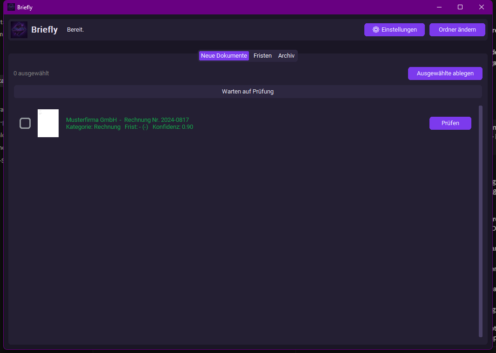
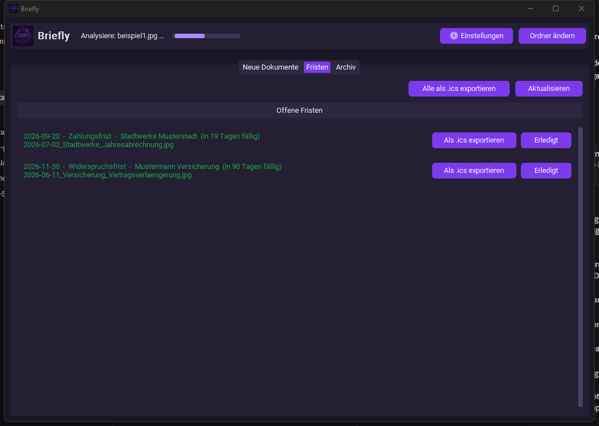
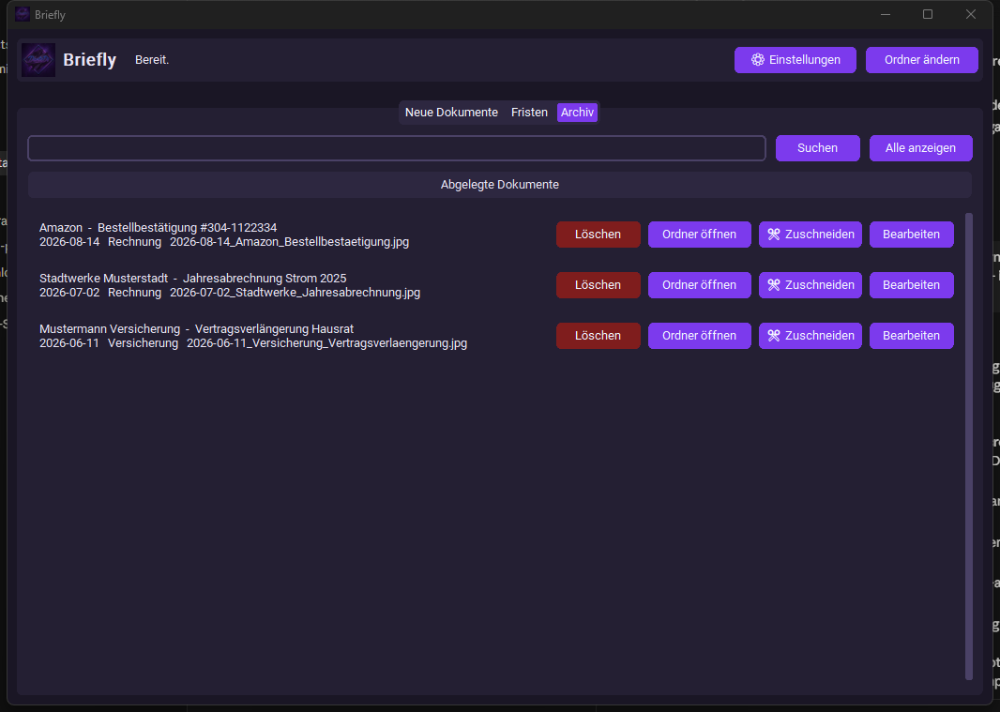

  

  # Briefly

  **Deine Post, automatisch sortiert — komplett lokal auf deinem PC.**

  
  
  
  

 

---

Briefly ist eine Desktop-Anwendung für Windows, die Fotos und Scans deiner
Briefe automatisch ausliest, sinnvoll umbenennt, in einer sauberen
Ordnerstruktur ablegt und dich rechtzeitig an Fristen erinnert — Rechnungen,
Bescheide, Kündigungsfristen, Widersprüche und mehr, ohne dass du selbst den
Überblick behalten musst.

## Die ehrliche Entstehungsgeschichte

Ich kann Server administrieren, Docker-Container jonglieren und mir nachts
um drei komplexe Bugs aus den Fingern saugen — aber ein stinknormaler
Antrag vom Amt bringt mich zuverlässig zu Fall. Fachinformatiker-Abschluss?
Hängt gerahmt an der Wand. Mein eigenes Übergangsgeld rechtzeitig und
korrekt beantragt? Fast nicht geschafft.

Mein bisheriges Fristenmanagement sah so aus: Post öffnen, denken "mache
ich gleich", mich von buchstäblich allem ablenken lassen, was nicht dieser
Brief ist, und am Ende zuverlässig mindestens die Hälfte aller Fristen
verpassen. Perfiderweise gilt dabei: Je bedrohlicher der Umschlag aussieht —
grau, gelb, am besten noch mit Fensterausschnitt und Amtslogo — desto
zuverlässiger schaffe ich es, ihn zu ignorieren oder komplett zu vergessen.

Also habe ich Briefly gebaut. Damit könnt ihr euren Papierkram weiterhin
genauso stiefmütterlich behandeln wie bisher — ihr müsst nur noch schnell
ein Foto davon machen, bevor er im Stapel verschwindet. Den Rest übernimmt
die Software, die im Gegensatz zu mir tatsächlich nichts vergisst.

Und ja, bevor ihr fragt: Ich schwöre, es geht mir primär darum, Leuten zu
helfen, die im selben Papierchaos ertrinken wie ich. Falls euch das als
Motivation nicht reicht, bin ich auch ehrlich: Es gibt für sowas bereits
genug Tools, für die man brav bezahlen soll, obwohl die Idee dahinter nicht
sonderlich kompliziert ist — warum also nicht selbst etwas Ordentliches
bauen? Und ganz nebenbei ist das Projekt für mich der perfekte Vorwand, in
der Praxis besser zu werden, statt nur Tutorials zu schauen.

## Warum Briefly?

- 📥 **Automatische Erkennung** — leg ein Foto/Scan in einen Ordner, Briefly
  erkennt Absender, Datum, Betreff, Kategorie und eventuelle Fristen
- ✅ **Nie blind übernommen** — jede Ablage läuft über einen
  Bestätigungs-Dialog, besonders bei Fristen wird nichts automatisch
  akzeptiert, wenn die Erkennung unsicher ist
- 🗂️ **Saubere Ablage** — automatische Ordnerstruktur nach Jahr/Absender,
  erkennt sogar ähnlich benannte Absender wieder, um Chaos zu vermeiden
- ⏰ **Fristen im Blick** — eigener Fristen-Bereich mit Farbcodierung
  (überfällig/bald fällig/später) und Kalender-Export (.ics)
- ✂️ **Manuelles Zuschneiden** — falls ein Foto mal schräg ist: Rechteck
  verschieben oder 4 Eckpunkte setzen (wie bei einer Handy-Scanner-App)
- 🔍 **Duplikat-Erkennung** — warnt, falls dasselbe Dokument versehentlich
  zweimal eingelesen wird

## Datenschutz zuerst

Briefly läuft standardmäßig **komplett lokal** über [Ollama](https://ollama.com)
mit einem lokalen Vision-Modell. Deine Dokumente verlassen dabei **nie**
deinen Rechner — keine Cloud, kein Upload, kein Tracking. Eine optionale
Cloud-Anbindung (für PDF-Verarbeitung) ist verfügbar, aber bewusst
abgeschaltet, bis du sie selbst aktivierst.

Nach der Einrichtung braucht Briefly gar keine Internetverbindung mehr —
sie wird nur noch gebraucht, wenn du ein Update ziehen willst, damit ich
Bugs fixen und eure Feature-Wünsche einbauen kann.

Und falls ihr euch insgeheim fragt, ob ihr mir dabei über den Weg trauen
könnt: absolut. Ich bin schon mit Weiterbildung, Debugging und der Frage
"warum tut das jetzt schon wieder nicht" mehr als ausgelastet - für eine
Karriere als Hacker fehlt mir schlicht die Zeit, und wenn ich ehrlich bin
auch das Talent. Von fremden Daten klauen oder Systemen knacken habe ich
exakt null Ahnung, so gerne ich mir das für einen coolen Film-Moment auch
manchmal wünschen würde. Was bei mir dagegen zuverlässig klappt: kleine,
saubere und sichere Tools bauen, die genau das tun, was sie sollen - und
sonst nichts. Genau das ist Briefly.

## Screenshots

<table>
  <tr>
    <td align="center"><b>Neue Dokumente</b> </td>
    <td align="center"><b>Fristen</b> </td>
  </tr>
  <tr>
    <td align="center" colspan="2"><b>Archiv</b> </td>
  </tr>
</table>

## Voraussetzungen

- Windows 10/11
- Für gute Geschwindigkeit: eine NVIDIA-Grafikkarte mit mind. 8 GB VRAM
  (ohne GPU läuft es auf der CPU, aber deutlich langsamer)

## Installation

Fertige Version unter **[Releases](../../releases)** herunterladen, entpacken,
`Briefly.exe` starten — keine Installation nötig, kein Python-Setup, alles
in einer eigenständigen `.exe`. Briefly richtet sich beim ersten Start
selbst ein (inkl. automatischem Herunterladen des KI-Modells).

## Technischer Unterbau

Briefly ist in Python geschrieben und nutzt u. a.:

- [Ollama](https://ollama.com) — lokales Vision-Language-Modell
- [CustomTkinter](https://github.com/TomSchimansky/CustomTkinter) — Oberfläche
- [OpenCV](https://opencv.org) — Bildvorverarbeitung (Perspektivkorrektur,
  Belichtungsausgleich)
- [PyInstaller](https://pyinstaller.org) — Packaging als eigenständige `.exe`

Die genaue Paketliste steht in [`requirements.txt`](requirements.txt),
Beispiel-Konfiguration in [`.env.example`](.env.example).

## Lizenz

Copyright © 2026 DanteDi. Alle Rechte vorbehalten — siehe [LICENSE](LICENSE).
Der Quellcode dieses Projekts ist nicht Teil dieses Repositories.
